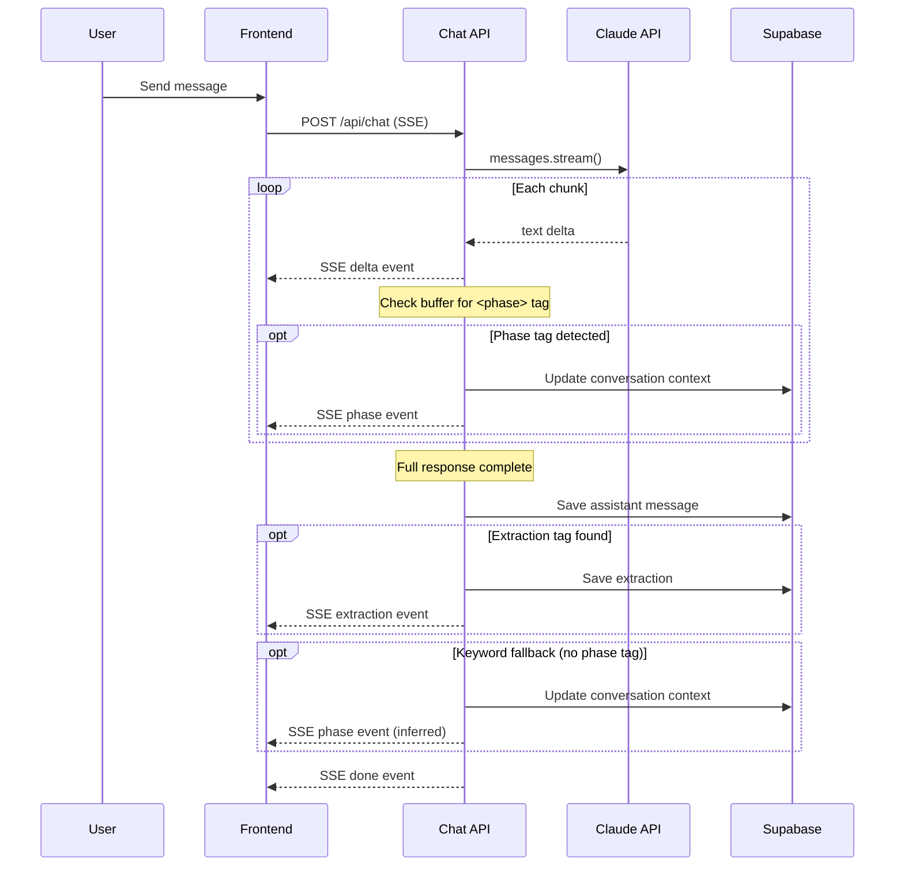

# Intake System Redesign with 8-Phase X-Ray

## Overview

Replace the current "Intake" and "Missing Gaps" top-nav items with a single "Intake" tab containing a left sidebar with three features: Initial Department X-Ray (8-phase interview), Update Missing Data, and Add New AI Priorities. Remove the approval gate. Add file upload, markdown table rendering, phase progress tracking with sub-progress, and auto-save with overwrite/rename handling.

## Problem Frame

The current intake system uses a lightweight 3-phase interview that doesn't match the rigorous 8-phase X-Ray methodology. It lacks phase visibility, doesn't enforce Phase 8 time-savings validation with employee counts, routes through an unnecessary approval gate, and splits related functionality across two nav items. New users lack a clear CTA to start their first X-Ray. (see origin: `docs/brainstorms/intake-redesign-requirements.md`)

## Requirements Trace

- R1-R5: Navigation & layout — single Intake tab, left sidebar, department dropdown with auto-save on switch, mobile collapse
- R6-R7: Empty state & progressive CTA
- R8-R12: 8-phase X-Ray interview — phase structure, progress bar with sub-progress, AI-driven transitions with keyword fallback, interview guide in prompt, Phase 8 enforcement with employee count
- R12a: File upload in chat
- R13: Full conversation history (1M token context window)
- R14: Auto-save at Phase 8 with overwrite/rename flow and archive snapshot
- R15-R16: Phase state persistence, pause/resume with loading indicator and recap
- R17-R18: All roles contribute, inline post-save editing
- R19-R21: Error handling (retry buttons)
- R22-R24: Completion screen with estimated labels, markdown file generation from normalized tables
- R25-R27: Update Missing Data including Phase 8 fields
- R28-R32: Add New AI Priorities with flexible value dimensions, completion screen with "Add Another" / "Back to Priorities"
- R33: All roles access all features

## Scope Boundaries

- Does not change any tabs/pages outside Intake (see origin)
- Review page deprecated — nav link removed, code left as dead code
- No email/notifications, no real-time collaboration, no full version history
- Old 3-phase conversations invisible via mode filtering — no data migration

## Context & Research

### Relevant Code and Patterns

- `src/app/api/chat/route.ts` — SSE streaming with `ReadableStream`, `<extraction>` tag regex parsing post-stream, 4 event types (delta, extraction, done, error)
- `src/components/ChatInterface.tsx` — Client SSE consumption via `fetch` + `getReader()`, plain-text rendering with `whitespace-pre-wrap`, mode union `'intake' | 'gap-fill'`
- `src/app/api/extractions/approve/route.ts` — 217-line approval route with department/priority/team upsert logic, owner-only gate, plain INSERT (no upserts)
- `src/app/org/[orgSlug]/layout.tsx` — Top nav with role-based filtering, no sidebar pattern
- `src/components/MissingGapsWorkflow.tsx` — 6-step workflow bar with circle indicators (closest to phase bar pattern)
- `src/lib/prompts.ts` — `INTAKE_SYSTEM_PROMPT` (3-phase), `GAP_FILL_SYSTEM_PROMPT`, context builders
- `src/lib/db.ts` — `getCompletenessScore()` checks 10 fields, `REQUIRED_PRIORITY_FIELDS` array
- `supabase/migrations/007_conversations.sql` — Conversations CHECK constraint `('intake', 'gap-fill')`, status CHECK `('active', 'extracted', 'approved')`
- `supabase/migrations/001_schema.sql` — `UNIQUE(department_id, rank)` on priorities, `UNIQUE(org_id, slug)` on departments
- `src/lib/supabase/admin.ts` — `createAdminClient()` for bypassing RLS
- `src/app/api/upload/route.ts` — FormData file upload (`.md` only), no Supabase Storage
- `remark`, `rehype-stringify`, `remark-html` in `package.json` — available but unused in chat

### Institutional Learnings

- SSE phase events must be parsed incrementally during streaming (inside `for await` loop), not post-response like extractions — the `<phase>` tag needs real-time detection
- The `<extraction>` tag regex pattern (`/<extraction>([\s\S]*?)<\/extraction>/`) is the template for `<phase>` tag parsing
- Extraction approval logic does NOT use upserts — it does check-then-insert. Must convert to `ON CONFLICT DO UPDATE` or transactional DELETE + re-insert
- Chat currently has NO markdown rendering — adding `react-markdown` + `remark-gfm` is required
- No sidebar pattern exists anywhere in the codebase — build as page-level component
- `getCompletenessScore()` is used in 6+ locations — interface change must be backward-compatible
- The `conversations.department_id` column already exists with `ON DELETE SET NULL`

## Key Technical Decisions

- **Phase state in JSONB context field**: Use the existing `conversations.context` JSONB field to store `{ phase: N, phase8_validation: {...} }`. Simpler than adding a column, and the JSONB is already used for conversation metadata. Querying by phase is not a common access pattern — conversations are always loaded by ID.
- **Department preference in localStorage**: Store `intake_dept_{orgId}` in localStorage. Zero-cost, same-device persistence, no server round-trip needed. Cross-device sync is not a V1 requirement.
- **File upload via Supabase Storage**: Upload files to Supabase Storage bucket, store file URL + metadata in a `message_attachments` table. Send file content to Claude API as base64 (documents/images) alongside the user message. DOCX and XLSX converted server-side (`mammoth` and `xlsx` libraries) since Claude API doesn't support binary Office formats natively. Size limit: 10MB per file, accepted types: PDF, DOCX, XLSX, CSV, TXT, MD, PNG, JPG, JPEG, GIF.
- **applyExtraction() as Postgres function**: The entire extraction application logic (department upsert, priority match-and-update, team member/milestone/brief creation, archive) runs inside a Postgres function called via `supabase.rpc()`. This provides true transactional atomicity since Supabase JS has no transaction API. On overwrite, priorities are matched by name and updated in place to preserve foreign key links to milestones and project briefs.
- **Sub-progress from static SKILL.md mapping with topic tag detection**: Define a static `PHASE_TOPICS` constant mapping each phase to its expected topic count from SKILL.md. Sub-progress = topics covered / total topics. Claude emits `<topic>N</topic>` tags after each topic question (same pattern as phase tags), detected incrementally during streaming. Keyword fallback applies if tags are missing.
- **Incremental phase tag detection during streaming**: Parse `<phase>` tags inside the `for await` streaming loop by checking the accumulated `fullResponse` buffer on each chunk. Emit the `type: "phase"` SSE event immediately when detected. This differs from extraction parsing (post-stream) because phase UI updates must be real-time.
- **Keyword fallback for phase transitions**: After the full response, if no `<phase>` tag was found but natural language patterns match (regex: `/(?:wraps up|move (?:on |in)?to|moving to|let(?:'s| me) (?:move|shift|transition) (?:on |in)?to) Phase (\d)/i`), infer the phase transition and log a warning.
- **Markdown rendering with react-markdown + remark-gfm**: Install `react-markdown` and `remark-gfm` for GFM table support. Apply to all assistant messages in the chat. Style tables with Tailwind utility classes.
- **Model upgrade**: Change chat route from `claude-sonnet-4-20250514` to `claude-sonnet-4-6` (latest). Increase `max_tokens` from 2048 to 8192 to accommodate large Phase 8 extractions.
- **Sidebar as page-level component**: Build the intake sidebar within the `/intake` route, not as an org-level layout change. Only the intake page needs it.

## Open Questions

### Resolved During Planning

- **Phase state storage**: JSONB context field (no new column needed)
- **Department preference**: localStorage keyed by org ID
- **File upload backend**: Supabase Storage with `message_attachments` table
- **Sub-progress calculation**: Static mapping from SKILL.md topic counts
- **Model version**: Upgrade to `claude-sonnet-4-6` with 8192 max_tokens

### Deferred to Implementation

- Exact keyword fallback regex patterns — may need tuning based on actual Claude output during testing
- Precise Supabase Storage bucket configuration and CORS settings
- Whether `react-markdown` needs custom renderers for any non-standard markdown patterns Claude produces
- Exact field mapping for flexible value dimensions in the extraction JSON schema

## High-Level Technical Design

> *This illustrates the intended approach and is directional guidance for review, not implementation specification. The implementing agent should treat it as context, not code to reproduce.*

```mermaid
graph TB
    subgraph "Intake Page"
        Sidebar[Left Sidebar<br/>Dept Dropdown + 3 Features]
        PhaseBar[Phase Progress Bar<br/>with Sub-Progress]
        Chat[Enhanced Chat<br/>Markdown + File Upload]
        Completion[Completion Screen<br/>Summary + Edit + Downloads]
    end

    subgraph "API Layer"
        ChatRoute[POST /api/chat<br/>SSE Stream + Phase Tags]
        ApplyFn[applyExtraction()<br/>Shared Upsert Logic]
        UploadRoute[POST /api/upload-attachment<br/>Supabase Storage]
        MarkdownRoute[GET /api/markdown/[deptId]<br/>On-Demand Generation]
    end

    subgraph "Database"
        Conversations[conversations<br/>mode + context JSONB]
        Messages[messages + attachments]
        Departments[departments<br/>+ archived_data]
        Priorities[priorities<br/>+ Phase 8 fields<br/>+ value dimensions]
    end

    Chat -->|SSE stream| ChatRoute
    ChatRoute -->|phase event| PhaseBar
    ChatRoute -->|extraction event| ApplyFn
    ApplyFn -->|upsert| Departments
    ApplyFn -->|upsert| Priorities
    Chat -->|file upload| UploadRoute
    Completion -->|download| MarkdownRoute
```



## Implementation Units

### Phase A: Foundation (Schema + Shared Logic)

- [ ] **Unit 1: Database migration 009**

**Goal:** Add all new columns and constraints needed by the redesign.

**Requirements:** R14, R15, R25, R30, Dependencies section

**Dependencies:** None

**Files:**
- Create: `supabase/migrations/009_intake_redesign.sql`

**Approach:**
- ALTER `conversations` mode CHECK: add `'new-priorities'` to allowed values
- ALTER `conversations` status CHECK: add `'completed'` (replacing `'approved'` semantically for auto-save flow)
- ADD columns to `priorities`: `frequency TEXT`, `hands_on_time TEXT`, `waiting_overhead TEXT`, `hidden_costs TEXT`, `automation_percentage TEXT`, `employees_affected TEXT`, `revenue_opportunity TEXT`, `growth_potential TEXT`
- ADD column to `departments`: `archived_data JSONB`
- ADD table `message_attachments`: `id UUID PRIMARY KEY`, `message_id UUID REFERENCES messages(id)`, `file_name TEXT`, `file_type TEXT`, `file_size INTEGER`, `storage_path TEXT`, `created_at TIMESTAMPTZ`
- ADD appropriate RLS policies for `message_attachments` (same pattern as messages — org members can read/write)
- CREATE Postgres function `apply_extraction(p_org_id UUID, p_extracted_data JSONB, p_conversation_id UUID, p_mode TEXT)` — implements the full extraction application logic inside a transaction. Modes: `'create'`, `'overwrite'`, `'append'`. On `overwrite`: archives existing department data, match-and-updates priorities by name to preserve foreign key links, inserts new priorities, deletes removed priorities. Called via `supabase.rpc('apply_extraction', {...})`

**Patterns to follow:**
- `supabase/migrations/007_conversations.sql` for CHECK constraint ALTER pattern
- `supabase/migrations/001_schema.sql` for RLS policy pattern

**Test scenarios:**
- Happy path: Migration applies cleanly to existing database with data
- Edge case: Existing conversations with `mode='intake'` and `mode='gap-fill'` remain valid after CHECK constraint change
- Happy path: New columns on priorities accept NULL values (backward-compatible with existing priorities)

**Verification:**
- Migration runs without errors on development database
- Existing data is unaffected
- New columns are queryable

---

- [ ] **Unit 2: Extract applyExtraction() shared function**

**Goal:** Refactor extraction approval logic into a shared, role-agnostic function with idempotent upserts.

**Requirements:** R14, R20, R31

**Dependencies:** Unit 1

**Files:**
- Create: `src/lib/apply-extraction.ts`
- Modify: `src/app/api/extractions/approve/route.ts`
- Test: `src/lib/__tests__/apply-extraction.test.ts`

**Approach:**
- Create a Postgres function `apply_extraction(p_org_id, p_extracted_data, p_conversation_id, p_mode)` that runs the entire operation inside a SQL transaction via `supabase.rpc('apply_extraction', {...})`
- Function accepts mode: `'create' | 'overwrite' | 'append'`
  - `create`: new department — insert department, priorities, team members, milestones, project briefs
  - `overwrite`: existing department — archive current data to `archived_data` JSONB, then match-and-update existing priorities (by name/rank) to preserve foreign key links to milestones and project briefs, INSERT truly new priorities, only DELETE priorities that no longer appear in the extraction. Update department fields, team members
  - `append`: add new priorities with `MAX(rank) + 1`, no department changes
- Department upsert: `ON CONFLICT (org_id, slug) DO UPDATE`
- The TypeScript side (`src/lib/apply-extraction.ts`) is a thin wrapper that calls `.rpc()` and handles error mapping
- The existing approve route becomes a thin wrapper calling `applyExtraction()`

**Patterns to follow:**
- `src/app/api/extractions/approve/route.ts` — existing field mapping logic (to replicate in SQL)
- `src/lib/supabase/admin.ts` — admin client pattern for the `.rpc()` call

**Test scenarios:**
- Happy path: New department creation with priorities, team members, milestones
- Happy path: Overwrite existing department — old data archived in `archived_data`, existing priorities updated in place (foreign keys preserved), new priorities inserted, removed priorities deleted
- Happy path: Append mode — new priorities get ranks starting after MAX(rank)
- Edge case: Department name collision across orgs — should not conflict (scoped by org_id)
- Error path: Transaction rolls back entirely on any failure (tested via intentional constraint violation)
- Edge case: Overwrite where a priority name matches an existing one — UPDATE preserves milestone/brief links
- Edge case: Overwrite where a priority no longer appears — DELETE only that priority
- Integration: Milestones created at stage 0 for each new priority, project brief snapshot created

**Verification:**
- Approve route still works identically (regression)
- `applyExtraction()` callable without role checks
- Retries produce same result (idempotent)
- Overwrite preserves milestone and project brief foreign key links for matched priorities

---

- [ ] **Unit 3: Update TypeScript types and getCompletenessScore()**

**Goal:** Add new types for Phase 8 fields, value dimensions, and update completeness scoring.

**Requirements:** R12, R25, R30

**Dependencies:** Unit 1

**Files:**
- Modify: `src/lib/types.ts`
- Modify: `src/lib/db.ts`
- Test: `src/lib/__tests__/completeness.test.ts`

**Approach:**
- Add Phase 8 fields to `DbPriority` interface: `frequency`, `hands_on_time`, `waiting_overhead`, `hidden_costs`, `automation_percentage`, `employees_affected`
- Add value dimension fields: `revenue_opportunity`, `growth_potential`
- Extend `getCompletenessScore()` to check Phase 8 fields when they are relevant (i.e., when the priority has any time-savings data). Backward-compatible: existing priorities without Phase 8 fields are scored on standard fields only
- Add `PHASE8_FIELDS` constant alongside `REQUIRED_PRIORITY_FIELDS`

**Patterns to follow:**
- Existing `getCompletenessScore()` pattern in `src/lib/db.ts:269`
- `REQUIRED_PRIORITY_FIELDS` constant pattern

**Test scenarios:**
- Happy path: Priority with all standard + Phase 8 fields filled → 100% complete
- Happy path: Priority with only standard fields filled (no Phase 8 data) → scored on standard fields only (backward-compatible)
- Edge case: Priority with partial Phase 8 fields → missing Phase 8 fields appear in `missing` array
- Edge case: Priority with revenue_opportunity but no time-savings fields → completeness adapts to value dimensions present
- Happy path: Existing code using `getCompletenessScore()` continues to work without changes

**Verification:**
- All 6+ existing call sites produce same results for existing priorities
- New Phase 8 fields surface in completeness scores when present

---

### Phase B: Chat Infrastructure (Streaming, Prompts, Rendering)

- [ ] **Unit 4: 8-phase system prompt**

**Goal:** Replace the 3-phase intake prompt with the full 8-phase interview guide including phase tag emission instructions.

**Requirements:** R8, R10, R11, R12

**Dependencies:** None

**Files:**
- Modify: `src/lib/prompts.ts`
- Reference: `artifacts/xray skill/references/interview-guide.md`, `artifacts/xray skill/SKILL.md`, `artifacts/SampleXRay.md`

**Approach:**
- Replace `INTAKE_SYSTEM_PROMPT` with a new prompt that:
  - Defines the 8 phases with their question banks from the interview guide
  - Instructs Claude to emit `<phase>N</phase>` tags when transitioning and `<topic>N</topic>` tags after each topic question within a phase (same pattern as `<extraction>`)
  - Enforces one-question-at-a-time, push-for-specifics principles
  - Phase 8: validates frequency, hands-on time, waiting/overhead, hidden costs, automation %, employees affected per priority
  - Handles backtracking conversationally (address earlier topics without formal phase regression)
  - On resume: generate recap of completed phases and key facts before continuing
- Add `NEW_PRIORITIES_SYSTEM_PROMPT` for the Add New Priorities mode
- Update `buildIntakeContext()` to include department name when available (for resume/overwrite scenarios)
- Add `buildNewPrioritiesContext(departmentProfile, existingPriorities)` context builder

**Patterns to follow:**
- Existing `INTAKE_SYSTEM_PROMPT` structure in `src/lib/prompts.ts`
- `artifacts/SampleXRay.md` as the quality reference for interview style

**Test scenarios:**
- Test expectation: none — prompt content is validated through integration testing during chat

**Verification:**
- System prompt includes all 8 phases from SKILL.md
- Phase tag emission instructions are clear
- Phase 8 validation requirements include employee count
- Resume recap instructions are present

---

- [ ] **Unit 5: Phase tag parsing and SSE phase events in chat route**

**Goal:** Add real-time phase detection during streaming and keyword fallback after streaming.

**Requirements:** R10, R15

**Dependencies:** Unit 4

**Files:**
- Modify: `src/app/api/chat/route.ts`
- Test: `src/app/api/chat/__tests__/phase-detection.test.ts`

**Approach:**
- Inside the `for await` streaming loop, check the buffer for `<phase>N</phase>` and `<topic>N</topic>` tags. To avoid O(n²) rescanning, track a `lastCheckedIndex` and only regex from that position forward on each chunk
- When phase detected: update conversation's JSONB context with new phase number, emit SSE event `{ type: 'phase', phase_number: N, phase_title: PHASE_TITLES[N], sub_progress: { current: 0, total: PHASE_TOPICS[N] } }`
- When topic detected: increment sub_progress.current, emit SSE event `{ type: 'topic', phase_number: N, sub_progress: { current: M, total: PHASE_TOPICS[N] } }`. Topic tags follow the same pattern as phase tags — instruct Claude to emit `<topic>N</topic>` after each topic question within a phase
- Track detected phases and topics to avoid re-emitting for same phase/topic
- After full response (post-loop): apply keyword fallback regex if no `<phase>` tag was detected in this response
- Update model to `claude-sonnet-4-6`, increase `max_tokens` to 8192
- Add `'new-priorities'` to mode handling in the route
- Strip `<phase>` tags from saved message content (same as extraction tag stripping)

**Patterns to follow:**
- Existing extraction tag detection at `src/app/api/chat/route.ts:102`
- SSE event emission pattern at line 90

**Test scenarios:**
- Happy path: Response containing `<phase>3</phase>` emits SSE phase event with phase_number 3
- Happy path: Response with both `<phase>` and `<extraction>` tags — both events emitted correctly
- Edge case: `<phase>` tag split across two stream chunks — detected when complete tag arrives
- Edge case: Malformed `<phase>` tag (e.g., `<phase>abc</phase>`) — logged, phase unchanged
- Happy path: Keyword fallback detects "Let me move into Phase 4" when no tag present
- Edge case: Two phase transitions in one response — both detected and last one wins for DB state
- Error path: Database update fails — SSE event still emitted, error logged (best-effort persistence)

**Verification:**
- Phase events arrive at the client in real-time during streaming
- Conversation context JSONB contains correct phase after each transition
- Keyword fallback fires when tags are absent

---

- [ ] **Unit 6: Markdown rendering in chat**

**Goal:** Add markdown rendering with GFM table support to the chat interface.

**Requirements:** R-dependency (markdown tables), Success Criteria (match SampleXRay.md formatting)

**Dependencies:** None (can parallel with other units)

**Files:**
- Modify: `src/components/ChatInterface.tsx`
- Modify: `package.json` (add `react-markdown`, `remark-gfm`)
- Test: `src/components/__tests__/ChatInterface.test.tsx`

**Approach:**
- Install `react-markdown` and `remark-gfm`
- Replace `whitespace-pre-wrap` plain-text rendering for assistant messages with `<ReactMarkdown remarkPlugins={[remarkGfm]}>`
- Keep user messages as plain text (they don't contain markdown)
- Style markdown output with Tailwind: tables get borders, alternating row colors, proper padding; headings get appropriate sizes; lists get proper indentation; bold/italic preserved
- The `displayContent()` function continues to strip `<extraction>` and `<phase>` tags before rendering

**Patterns to follow:**
- `remark`/`rehype` already in `package.json` — consistent ecosystem
- Chat message styling in `ChatInterface.tsx:196-215`

**Test scenarios:**
- Happy path: Assistant message with markdown table renders as an HTML table with borders
- Happy path: Bold, italic, bullet lists render correctly
- Happy path: `<extraction>` and `<phase>` tags are stripped before markdown rendering
- Edge case: Message with no markdown renders same as before (plain text appearance)
- Edge case: Very wide table on mobile — horizontal scroll, not overflow

**Verification:**
- Phase 8 summary table (from SampleXRay.md format) renders as a readable, styled table
- Existing chat messages continue to look correct

---

- [ ] **Unit 7: File upload in chat**

**Goal:** Allow users to attach files during interviews that are included in Claude's context.

**Requirements:** R12a

**Dependencies:** Unit 1 (message_attachments table)

**Files:**
- Create: `src/app/api/upload-attachment/route.ts`
- Modify: `src/components/ChatInterface.tsx`
- Modify: `src/app/api/chat/route.ts`

**Approach:**
- New API route: Accept FormData with file, upload to Supabase Storage bucket `chat-attachments`, save metadata to `message_attachments` table, return `{ storageUrl, fileName, fileType }`
- ChatInterface: Add file attachment button (paperclip icon) next to the send button. Show attached file names above the input. On send, upload files first, then include attachment metadata in the chat request body
- Chat route: When message includes attachments, fetch file content from Supabase Storage. For natively supported types (PDF, TXT, MD, CSV, PNG, JPG, JPEG, GIF), convert to base64 and include as content blocks in the Anthropic API call (`type: 'document'` for PDFs/text, `type: 'image'` for images). For DOCX and XLSX, convert server-side before sending to Claude: use `mammoth` (DOCX → plain text) and `xlsx` (XLSX → CSV), then send the converted text as a document content block
- Size limit: 10MB per file. Accepted types: PDF, DOCX, XLSX, CSV, TXT, MD, PNG, JPG, JPEG, GIF
- Dependencies: add `mammoth` and `xlsx` packages for server-side file conversion

**Patterns to follow:**
- `src/app/api/upload/route.ts` — existing FormData handling pattern
- Anthropic SDK document/image content block format

**Test scenarios:**
- Happy path: Upload a PDF, send message — Claude references PDF content in response
- Happy path: Upload an image — displays thumbnail in chat, Claude receives image
- Edge case: File exceeds 10MB — error message shown, upload blocked
- Edge case: Unsupported file type — error message shown
- Error path: Supabase Storage upload fails — error shown, message can still be sent without attachment
- Happy path: Multiple files attached to one message

**Verification:**
- Attached files appear in chat messages
- Claude's responses reference uploaded file content
- Files persist in Supabase Storage and are retrievable

---

### Phase C: Intake Page & Navigation

- [ ] **Unit 8: Intake page with left sidebar and department dropdown**

**Goal:** Build the new intake page layout with left sidebar navigation and department dropdown.

**Requirements:** R1, R2, R3, R4, R5, R6, R7, R33

**Dependencies:** Unit 1 (for querying departments)

**Files:**
- Create: `src/app/org/[orgSlug]/intake/IntakeSidebar.tsx`
- Rewrite: `src/app/org/[orgSlug]/intake/page.tsx`
- Modify: `src/app/org/[orgSlug]/layout.tsx`

**Approach:**
- `page.tsx`: Server component that loads org departments, user's conversations for the selected department, and renders the sidebar layout
- `IntakeSidebar.tsx`: Client component with department dropdown (all org departments + "+ New Department"), three feature options (Initial Department X-Ray, Update Missing Data, Add New AI Priorities), active feature state
- Department dropdown: persist selection to `localStorage` key `intake_dept_{orgId}`, restore on mount
- Auto-save on department switch: when switching with an active interview, save current conversation state before loading new department's state
- Empty state (R6): prominent "Start New Department X-Ray" CTA when org has no departments
- Progressive CTA (R7): department dropdown replaces CTA once departments exist
- Layout changes: update Intake nav link roles to `['owner', 'admin', 'member']`, remove "Missing Gaps" and "Review" nav links, move unfiled badge count to Intake link
- Mobile responsive (R5): sidebar collapses to horizontal tab strip with short labels ("X-Ray", "Missing", "New") on `md:` breakpoint, department dropdown above tabs

**Patterns to follow:**
- `src/app/org/[orgSlug]/layout.tsx` — role-based nav filtering
- `src/components/MissingGapsWorkflow.tsx` — step indicator UI pattern

**Test scenarios:**
- Happy path: User with no departments sees empty state with prominent CTA
- Happy path: User with departments sees sidebar with dropdown, default to last-used department
- Happy path: Switching departments during active interview auto-saves and loads new state
- Happy path: "+ New Department" starts a fresh X-Ray interview
- Edge case: User's localStorage department no longer exists — falls back to first department
- Happy path: Mobile viewport shows horizontal tab strip instead of sidebar
- Integration: All three roles (owner, admin, member) can access the Intake tab

**Verification:**
- Empty state renders for orgs with no departments
- Department dropdown lists all org departments
- Feature switching works without page reload
- Mobile layout collapses correctly

---

- [ ] **Unit 9: Phase progress bar with sub-progress**

**Goal:** Build the phase progress bar component docked at the top of the chat area.

**Requirements:** R9, R10 (frontend)

**Dependencies:** Unit 5 (SSE phase events)

**Files:**
- Create: `src/components/PhaseProgressBar.tsx`
- Create: `src/lib/phase-config.ts`
- Test: `src/components/__tests__/PhaseProgressBar.test.tsx`

**Approach:**
- `phase-config.ts`: Static configuration — `PHASES` array with phase number, title, and topic count from SKILL.md. Export `PHASE_TITLES` and `PHASE_TOPICS` maps used by both frontend and backend
- `PhaseProgressBar.tsx`: Client component receiving `currentPhase`, `subProgress` props
  - Displays 8 phase segments with titles
  - Green checkmark on completed phases, highlighted current phase, grey future phases
  - Sub-progress indicator within current phase (e.g., mini progress bar or "3/5 topics")
  - `role="list"` with `aria-current="step"` for accessibility
  - `aria-live="polite"` region announces phase transitions to screen readers
  - Mobile: collapses to "Phase 4/8: Workflows" single-line display at `md:` breakpoint
- Listen for SSE `type: "phase"` events to update in real-time
- On page load (resume), read phase from conversation's context JSONB

**Patterns to follow:**
- `src/components/MissingGapsWorkflow.tsx` STEPS array and circle indicators

**Test scenarios:**
- Happy path: Progress bar shows Phase 1 as active on new interview
- Happy path: SSE phase event advances the bar to Phase 3 with green checkmarks on 1-2
- Happy path: Sub-progress shows "2/5 topics" within current phase
- Edge case: Resume at Phase 5 — phases 1-4 show checkmarks, 5 is active
- Happy path: Mobile view shows collapsed "Phase 5/8: Handoffs" format
- Edge case: Phase 8 completion — all 8 phases show green checkmarks

**Verification:**
- Progress bar updates in real-time during streaming
- Persisted phase state correctly restores on page load
- Screen reader announces phase transitions

---

### Phase D: X-Ray Interview Flow

- [ ] **Unit 10: X-Ray interview chat integration**

**Goal:** Wire up the 8-phase X-Ray interview with the new intake page, progress bar, and enhanced chat.

**Requirements:** R8, R10, R11, R12, R13, R15, R16

**Dependencies:** Units 4, 5, 6, 8, 9

**Files:**
- Create: `src/app/org/[orgSlug]/intake/XRayInterview.tsx`
- Modify: `src/components/ChatInterface.tsx` (add phase event handling, mode extensions)

**Approach:**
- `XRayInterview.tsx`: Client component that orchestrates the interview
  - Renders PhaseProgressBar + ChatInterface
  - Manages phase state (from SSE events or loaded conversation context)
  - Handles resume flow: show "Claude is reviewing your progress..." loading indicator while recap generates
  - Handles conversation creation for new interviews (mode: `'intake'`, department name in context JSONB)
  - On Phase 8 completion (extraction event): trigger overwrite/rename check before auto-save
- Extend `ChatInterface` props: add `onPhaseChange` callback, accept `mode: 'intake' | 'gap-fill' | 'new-priorities'`
- ChatInterface handles new SSE event types: `phase` (calls `onPhaseChange`), existing `delta`/`extraction`/`done`

**Patterns to follow:**
- `src/app/org/[orgSlug]/intake/IntakeChat.tsx` — existing chat wrapper pattern
- `src/app/org/[orgSlug]/unfiled/chat/GapFillChat.tsx` — gap-fill wrapper pattern

**Test scenarios:**
- Happy path: Start new interview → conversation created → Phase 1 begins → progress bar at Phase 1
- Happy path: Complete all 8 phases → extraction event → overwrite/rename check → auto-save → completion screen
- Happy path: Resume interview at Phase 4 → loading indicator → recap message → continue from Phase 4
- Happy path: File upload during Phase 3 → Claude references uploaded content
- Edge case: Browser closed mid-Phase 5 → conversation saved → resume shows Phase 5 on return
- Integration: Phase progress bar updates in real-time as Claude transitions phases

**Verification:**
- Full 8-phase interview completes end-to-end
- Phase state persists correctly across sessions
- Resume flow shows loading indicator and recap

---

- [ ] **Unit 11: Phase 8 overwrite/rename and auto-save flow**

**Goal:** Implement the Phase 8 completion flow — department existence check, overwrite/rename dialog, archive, and auto-save.

**Requirements:** R14, R17, R18, R20

**Dependencies:** Unit 2 (applyExtraction), Unit 10

**Files:**
- Create: `src/components/OverwriteDialog.tsx`
- Create: `src/app/api/intake/complete/route.ts`
- Test: `src/app/api/intake/__tests__/complete.test.ts`

**Approach:**
- New API route `POST /api/intake/complete`: receives extraction data + org ID + department name
  - Checks if department with same name exists in org
  - Returns `{ exists: boolean, departmentId?: string }` for frontend to decide
- `OverwriteDialog.tsx`: Modal component shown when department exists. Options: "Overwrite (archived for recovery)" or "Rename this department". Rename option includes text input for new name
- On overwrite: calls `applyExtraction()` with mode `'create'` (archives + overwrites)
- On rename: calls `applyExtraction()` with updated department name
- On new (no conflict): calls `applyExtraction()` directly
- Error handling: retry banner on save failure (R20)

**Patterns to follow:**
- Modal/dialog patterns in existing components
- `src/lib/apply-extraction.ts` function from Unit 2

**Test scenarios:**
- Happy path: New department name → auto-save directly → completion screen
- Happy path: Existing department name → overwrite dialog → user chooses overwrite → data archived → new data saved
- Happy path: Existing department name → user chooses rename → enters new name → saved as new department
- Edge case: Rename to another existing name → shows error, asks for different name
- Error path: Auto-save fails → error banner with "Retry Save" button → retry succeeds
- Integration: After save, conversation status updated to `'completed'`, department_id set

**Verification:**
- Overwrite correctly archives existing data
- Rename creates a distinct department
- Retry button works on failure

---

- [ ] **Unit 12: Completion screen with inline editing and markdown downloads**

**Goal:** Build the post-interview completion screen with summary, inline editing, and markdown downloads.

**Requirements:** R18, R22, R23, R24

**Dependencies:** Unit 11

**Files:**
- Create: `src/app/org/[orgSlug]/intake/CompletionScreen.tsx`
- Create: `src/app/api/markdown/[departmentId]/route.ts`

**Approach:**
- `CompletionScreen.tsx`: Shows department name, team member count, priority count, total estimated time savings (with employee multiplier), incomplete estimate count with grey checkbox icons
  - Inline editable fields: department name, team member names/titles, priority names, time estimates — save-on-blur with spinner, revert + inline error on failure
  - Download buttons for Department Profile and Automation Priorities markdown files
  - "Update Missing Data" CTA if incomplete estimates exist
- `GET /api/markdown/[departmentId]?type=profile|priorities`: Generate markdown on-demand from normalized tables (departments, priorities, team_members) using templates from `artifacts/xray skill/references/output-templates.md`. Return as `Content-Disposition: attachment` download
- Time savings labeled as "estimated" throughout
- Inline edit errors use `role="alert"` for screen reader accessibility

**Patterns to follow:**
- `artifacts/xray skill/references/output-templates.md` — markdown templates
- Save-on-blur pattern (build from scratch — no existing pattern)

**Test scenarios:**
- Happy path: Completion screen shows correct summary counts after auto-save
- Happy path: Edit department name inline → save-on-blur → updates database → subsequent markdown download reflects change
- Happy path: Download Department Profile markdown → file matches template structure
- Happy path: Download Automation Priorities markdown → includes all priorities with estimates
- Edge case: Inline edit fails → field reverts to original value, inline error shown
- Edge case: 3 of 7 priorities have incomplete estimates → count shown with grey checkboxes and "Update Missing Data" prompt
- Happy path: Re-visit completion screen from sidebar → loads from DB, shows download buttons

**Verification:**
- All summary counts are accurate
- Inline edits persist to database
- Markdown files generate correctly from normalized tables
- Downloads work on re-visit (not just first view)

---

### Phase E: Update Missing Data & Add New Priorities

- [ ] **Unit 13: Update Missing Data feature**

**Goal:** Integrate the missing data view and gap-fill chat into the intake sidebar.

**Requirements:** R25, R26, R27

**Dependencies:** Unit 3 (updated completeness scoring), Unit 8 (sidebar)

**Files:**
- Create: `src/app/org/[orgSlug]/intake/UpdateMissingData.tsx`
- Modify: `src/lib/prompts.ts` (update gap-fill prompt for Phase 8 fields)

**Approach:**
- `UpdateMissingData.tsx`: Client component that shows priorities with missing fields for the selected department
  - Groups missing fields by category: standard fields vs. Phase 8 time-savings fields
  - Each priority row is expandable, showing which fields are missing
  - "Fill Missing Data" button per priority launches gap-fill chat (reusing ChatInterface with mode `'gap-fill'`)
  - Empty state (R27): "Everything looks complete" with CTA to "Add New AI Priorities"
- Update `GAP_FILL_SYSTEM_PROMPT` to include Phase 8 time-savings questions when those fields are missing
- Reuse existing gap-fill conversation mode and extraction pattern

**Patterns to follow:**
- `src/components/MissingGapsWorkflow.tsx` — expandable rows, completeness badges
- `src/app/org/[orgSlug]/unfiled/chat/GapFillChat.tsx` — gap-fill chat wrapper

**Test scenarios:**
- Happy path: Department with 3 priorities with missing fields → list shows all 3 with expandable details
- Happy path: Click "Fill Missing Data" → gap-fill chat launches with correct priority context
- Happy path: Phase 8 field missing (e.g., employees_affected) → gap-fill chat asks about it
- Happy path: All fields complete → "Everything looks complete" empty state with CTA
- Edge case: Priority with only Phase 8 fields missing (standard fields all present) → still shows as incomplete
- Integration: After gap-fill completes, priority updates and row disappears from list

**Verification:**
- Missing fields include both standard and Phase 8 fields
- Gap-fill chat correctly fills Phase 8 data
- Empty state appears when all fields are complete

---

- [ ] **Unit 14: Add New AI Priorities feature**

**Goal:** Build the Add New AI Priorities chat with department context loading, completion screen, and pause/resume.

**Requirements:** R28, R29, R30, R31, R32

**Dependencies:** Units 2, 4, 6, 8, 10

**Files:**
- Create: `src/app/org/[orgSlug]/intake/AddNewPriorities.tsx`
- Modify: `src/app/api/chat/route.ts` (add `'new-priorities'` mode branch)

**Approach:**
- `AddNewPriorities.tsx`: Client component
  - On mount: load full department profile + all existing priorities from DB as context snapshot
  - If no existing priorities: use exploratory framing prompt
  - Renders ChatInterface with mode `'new-priorities'`
  - On extraction event: show completion screen with summary of added priority
  - Completion screen CTAs: "Add Another AI Priority" (starts fresh chat with updated context) or "Back to AI Priorities" (navigates to priorities view)
  - Pause/resume: same as X-Ray — save per-message, resume from conversation with loading indicator
- Chat route: add `'new-priorities'` mode branch that uses `NEW_PRIORITIES_SYSTEM_PROMPT` with department context
- `applyExtraction()` called with mode `'append'` for rank assignment

**Patterns to follow:**
- `src/app/org/[orgSlug]/intake/IntakeChat.tsx` — chat wrapper pattern
- `src/lib/prompts.ts` `buildGapFillContext()` — context builder pattern

**Test scenarios:**
- Happy path: Start new priorities chat with existing department → Claude references existing priorities
- Happy path: Claude emits extraction → completion screen shows priority summary
- Happy path: "Add Another" → fresh chat with updated context including just-added priority
- Happy path: "Back to AI Priorities" → navigates to priorities page
- Happy path: Resume incomplete chat → loading indicator → recap → continue
- Edge case: Department with no existing priorities → exploratory framing prompt used
- Integration: New priority saved to DB with correct rank (after existing priorities)

**Verification:**
- Department context is loaded and referenced by Claude
- New priorities auto-save with correct ranks
- Completion screen shows accurate summary
- "Add Another" starts truly fresh chat with latest context

---

### Phase F: Polish & Metrics

- [ ] **Unit 15: Measurable success metrics tracking**

**Goal:** Add tracking for X-Ray completion rate, time-to-complete, estimate fill rate, and priority count.

**Requirements:** Measurable success criteria

**Dependencies:** Units 10, 11

**Files:**
- Modify: `src/app/api/chat/route.ts` (timestamp tracking)
- Modify: `src/lib/db.ts` (metrics query functions)
- Create: `src/app/org/[orgSlug]/intake/metrics.ts`

**Approach:**
- Track in conversation's JSONB context: `started_at` (first message timestamp), `completed_at` (Phase 8 extraction timestamp)
- Query functions: `getXRayCompletionRate(orgId)` (completed / started), `getAverageTimeToComplete(orgId)`, `getEstimateFillRate(orgId)` (priorities with all Phase 8 fields / total), `getAveragePriorityCount(orgId)`
- These are read-only query functions for now — surfacing them in a dashboard is future work

**Patterns to follow:**
- `src/lib/db.ts` aggregation functions like `getTopWins()`

**Test scenarios:**
- Happy path: After completing an X-Ray, completion rate query returns correct percentage
- Happy path: Time-to-complete calculated correctly from started_at to completed_at
- Edge case: Abandoned X-Ray (started, never completed) counted as incomplete in rate
- Happy path: Estimate fill rate correctly handles priorities with partial Phase 8 data

**Verification:**
- Metrics functions return accurate data after interview completion
- Abandoned interviews correctly tracked as incomplete

---

## System-Wide Impact

- **Interaction graph:** The intake page now creates conversations, saves messages, creates extractions, and calls `applyExtraction()` directly — bypassing the review page entirely. The existing approve route is preserved but no longer reachable from the new UI.
- **Error propagation:** Chat API errors surface as inline retry buttons (R19). Auto-save errors surface as banner with retry (R20). Markdown generation errors degrade gracefully (R21).
- **State lifecycle risks:** Department records are created only at Phase 8 completion. Mid-interview abandonment leaves conversation messages saved but no department/priority records — this is intentional and resumable.
- **API surface parity:** The `applyExtraction()` function is now the single entry point for all data creation, used by both the legacy approve route and the new auto-save flow.
- **Integration coverage:** SSE phase events must be tested end-to-end (backend parse → SSE emit → frontend progress bar update). File upload must be tested through the full chain (upload to Storage → fetch for Claude API → response references content).
- **Unchanged invariants:** Priorities page, dashboard, tracker, and all other tabs are unchanged. Existing gap-fill conversations continue to work. The priorities table schema is additive (new nullable columns).

## Risks & Dependencies

| Risk | Mitigation |
|------|------------|
| Claude inconsistently emits `<phase>` tags | Keyword fallback detection + logging. System prompt explicitly instructs tag emission. Monitor during testing. |
| Phase 8 extraction JSON too large for single response | `max_tokens` increased to 8192. If still insufficient, split extraction across multiple Claude turns. |
| File upload to Supabase Storage adds latency | Upload happens before message send (user sees upload progress). File content cached for Claude API call. |
| `react-markdown` bundle size impact | Tree-shake unused plugins. Lazy-load markdown renderer for chat component. |
| Breaking changes in Next.js 16.2.1 | Read `node_modules/next/dist/docs/` before implementation per AGENTS.md guidance. |
| Existing priorities pages break with new columns | All new columns are nullable — existing queries unaffected. |

## Documentation / Operational Notes

- `artifacts/SampleXRay.md` is the quality reference for interview style and output format
- `artifacts/xray skill/SKILL.md` and `artifacts/xray skill/references/interview-guide.md` are the authoritative sources for the 8-phase structure
- `artifacts/xray skill/references/output-templates.md` provides the markdown download templates
- After shipping, the Review page (`/org/[slug]/review`) and Missing Gaps page (`/org/[slug]/unfiled`) become dead code — track for cleanup

## Sources & References

- **Origin document:** [docs/brainstorms/intake-redesign-requirements.md](docs/brainstorms/intake-redesign-requirements.md)
- Related code: `src/app/api/chat/route.ts`, `src/app/api/extractions/approve/route.ts`, `src/components/ChatInterface.tsx`
- X-Ray skill: `artifacts/xray skill/SKILL.md`, `artifacts/xray skill/references/interview-guide.md`, `artifacts/xray skill/references/output-templates.md`
- Sample transcript: `artifacts/SampleXRay.md`
